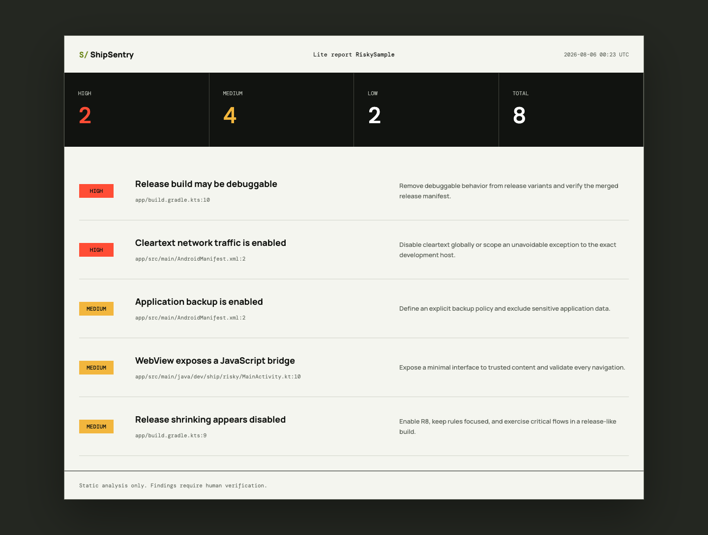

# ShipSentry

ShipSentry Lite is a zero-dependency static scanner for common Android release risks. It produces a Markdown report with evidence and suggested fixes.

[Open the live product page](https://adamglin0.github.io/shipsentry/) | [Download v0.1.0](https://github.com/adamglin0/shipsentry/releases/tag/v0.1.0) | [View the sample report](https://adamglin0.github.io/shipsentry/report.html)



## Run the free scan

```bash
curl -fsSLO https://raw.githubusercontent.com/adamglin0/shipsentry/main/scan.sh
chmod +x scan.sh
./scan.sh /path/to/android-project shipsentry-report.md
```

The script reads local text files only. It does not upload source code, call an API, or modify the scanned project.

## What Lite checks

- Debuggable release configurations
- Cleartext network traffic
- Common committed-secret and signing-secret patterns
- Backup configuration
- Risky WebView bridges and file access
- Disabled release shrinking
- Development logs and follow-up markers

Static matches can be false positives. A clean Lite report is not proof that an app is secure or Play-ready.

## Founding audit

The founding audit turns the Lite output into a human-reviewed release report:

- Review of one Android app module, up to 30,000 source lines
- Prioritized findings with file-level evidence
- Gradle, manifest, network security, WebView, secrets, logging, R8, and release hygiene review
- One follow-up clarification round
- Target delivery: three business days after source access is confirmed

Founding price: **39 USDT on TRON (TRC20)** for the first three accepted projects.

Open an [audit request](https://github.com/adamglin0/shipsentry/issues/new?template=audit-request.yml) before paying. Do not post private source code, credentials, or unpublished vulnerability details in a public issue.

## Payment safety

Payment address: `TSg3cFixQzkczF9BJ5DqHCnE3AP3AjRhgi`

- Send only USDT using the TRON (TRC20) network.
- Submit an audit request and wait for scope acceptance before paying.
- Network fees and transfers sent using the wrong asset, address, or network cannot be recovered by this project.
- If an accepted audit cannot be started, the received amount will be returned to the originating address, less unavoidable network fees.

## License

ShipSentry Lite is released under the MIT License. The paid offer is a review service, not a software license or security certification.
